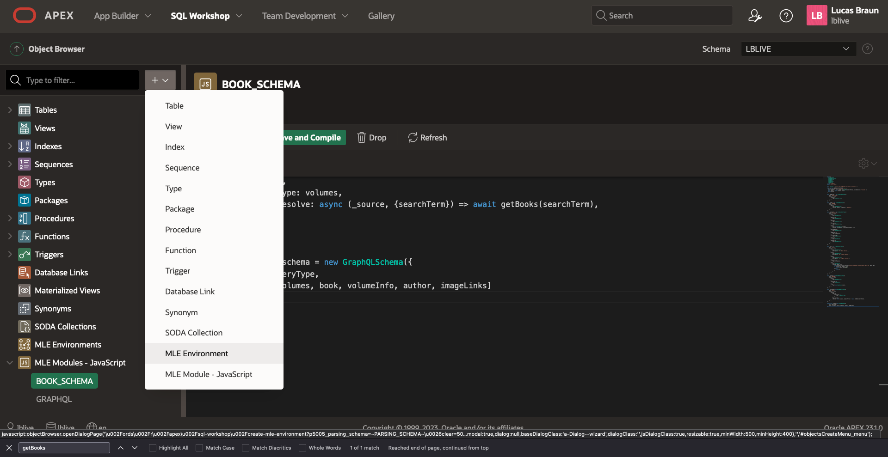

# Building an end-to-end Bookstore App with External Community Modules

## Introduction
In this lab, you will learn how to build an end-to-end bookstore application within a very short time, mainly relying on external community JavaScript modules, the built-in fetch API as well as a tiny little bit of additional JavaScript glueing.
You will utilize the following two external JavaScrip libraries/modules:

- GraphQL
- Mustache

Estimated Lab Time: 20 minutes

## Task 1: First steps with fetch API

### Setting up Access Control
In order to be able to make callouts to public internet, we need to make sure to add the corresponding access control lists. Execute the following script which will prompt you for the schema name from SQL*Plus as sysdba (or ask your administrator to perform it for you):

```
<copy>
declare
    l_hostname varchar2(64) := '*.googleapis.com';
    l_port number := 443;
    l_principal varchar2(64);

    procedure add_priv(p_priv varchar2, p_host varchar2, p_port number) is
    begin
        dbms_network_acl_admin.append_host_ace (
            host       => p_host, 
            lower_port => p_port,
            upper_port => p_port,
            ace        => 
                xs$ace_type(privilege_list => xs$name_list(p_priv),
                            principal_name => l_principal,
                            principal_type => xs_acl.ptype_db));
    end;

    procedure add_priv_resolve(p_host varchar2) is
    begin
        dbms_network_acl_admin.append_host_ace (
            host       => p_host,
            ace        => 
                xs$ace_type(privilege_list => xs$name_list('resolve'),
                            principal_name => l_principal,
                            principal_type => xs_acl.ptype_db)); 
    end;
begin
    l_principal := '&please_enter_schema_name';
    add_priv('connect',l_hostname,l_port);
    add_priv_resolve(l_hostname);
    add_priv('http',l_hostname,l_port);
    commit;
end;
/
</copy>
```

### Setting up the Wallet
The other thing that you need is a wallet and making sure that we set that wallet each time we use `fetch` functionality.
We therefore create a wrapper function `SET_WALLET` as follows.
First go to SQL Workshop -> SQL Commands and choose "PL/SQL" as your language in the top.


Next, if you are operating in an Autonomous Database environment or Live Lab sandbox, the wallet is preconfigured, so all you need to do is execute:

```
<copy>
CREATE OR REPLACE PROCEDURE SET_WALLET AS BEGIN NULL; END;
/
</copy>
```

Conversely, if you are in a different environment, you may have to create your wallet first, for instance by following the steps provided in this
[article](https://github.com/Dani3lSun/oracle-ca-wallet-creator).

Once, your wallet is created and installed on the server, create the function as follows (adapt the directory name to match the location of your certificate):

```
<copy>
CREATE OR REPLACE PROCEDURE SET_WALLET AS BEGIN utl_http.set_wallet('file:/opt/oracle/wallet-creation/CAcertBundle'); END;
/
</copy>
```

### Using the fetch API
Now that we have a function for setting the wallet appropriately, we can use the JavaScript fetch API to retrieve our desired book results and print it to the console.
Switch the language in SQL commands to "JavaScript" and excute the following snippet:

```
<copy>
await import('mle-js-fetch');
const BASE_URL = "https://www.googleapis.com/books/v1/volumes?q=";

async function getBooks(searchTerm) {
  session.execute("begin set_wallet; end;");
  const response = await fetch(`${BASE_URL}${searchTerm}`, { credentials: "include" });
  const result = await response.json();
  return result;
}

const bookResults = await getBooks('Oracle');
// book results contains kind (string), totalItems (number), items (objects with the actual books inside)
console.log(`Total Items: ${bookResults.totalItems}`);
console.log(`First Item: ${JSON.stringify(bookResults.items[0])}`);
</copy>
```

If executed correctly, you should see something like this:


We now know how to use the fetch API in principle. We'll use this knowledge again later to assemble the app as a whole.

## Task 2: Importing GraphQL Module
Our application will make use of the open-source [GraphQL](https://www.npmjs.com/package/graphql) module.
Using GraphQL comes with a number of advantages which are well explained in
[this blog post](https://medium.com/@jeff_long/when-and-why-to-use-graphql-24f6bce4839d).
In our case, we'll use it to combine data retrieved from the Google Books API with some local data in the database and offer this as one unified service.

In order to install the GraphQL module into Oracle as MLE module, fist go to the object browser:


Then, click on the "+" button in the left pane and select "MLE Module - JavaScript" or simply select this option from the middle pane:


This opens a dialog in which you provide the name of your module, `GRAPHQL`, as well as the version, `16.6.0` (not stricly required, but good practise).
You select `URL` as source type and enter `https://cdn.jsdelivr.net/npm/graphql@16.6.0/+esm`.
Note that you can get open-source JavaScript modules like this one from the CDN of your choice as long as they are provided in terms of an EcmaScript module (ESM).


What is left to do is to hit the "Create MLE Module" button and wait a few seconds to get the confirmation that the module was successfully created.


## Task 3: Combining fetch, GraphQL and SQL Driver to produce Book Service Results

### Creating the Inventory Table

Next, let's create a table to store what we have on stock for some of those books. In SQL commands, switch language to "PL/SQL" and execute:

```
<copy>
create table inventory(
    id VARCHAR(128) PRIMARY KEY NOT NULL,
    stock NUMBER
);
</copy>
```

After this table is created, let's fill it with some data. In the search bar, enter "Data Workshop" and open it:


Then, click on "Load Data" and select `inventory.xlsx` which you can download [here](files/inventory.xlsx).


Make sure to select "Existing Table" and select the INVENTORY table. After that click on "Load Data".


The data gets loaded and should look something like this:


### Creating the GraphQL Schema to combine Data fetched from Internet with data from the Database

Next we create a module where we define the GraphQL schema for the books that we want to retrieve in our application.
We define a number of GraphQL object types as well as a GraphQL schema object that combines those. 
Some of the object types have so-called resolvers that tell the algorithm how to retrieve information, some of them use `fetch`, some of them query the database by using `session.execute`.

Go into the object browser again and create a new MLE module named "BOOK_SCHEMA", selecting the "Source Code" option this time and inputting the following code:

```
<copy>
import {
  GraphQLSchema,
  GraphQLObjectType,
  GraphQLString,
  GraphQLInt,
  GraphQLFloat,
  GraphQLList
} from 'graphql';
import 'mle-js-fetch'; 

const BASE_URL = "https://www.googleapis.com/books/v1/volumes?q=";

async function getBooks(searchTerm) {
  session.execute("begin set_wallet; end;");
  const response = await fetch(`${BASE_URL}${searchTerm}`, { credentials: "include" });
  const result = await response.json();
  return result;
}

const imageLinks = new GraphQLObjectType({
    name: 'IMAGE_LINKS',
    fields: () => ({
        thumbnail: { 
            type: GraphQLString, 
        },
    })
});

const author = new GraphQLObjectType({
    name: 'AUTHOR',
    fields: () => ({
        name: { 
            type: GraphQLString,
            resolve: (author) => author || "Unknown",
        },
    })
});

const volumeInfo = new GraphQLObjectType({
    name: 'VOLUME_INFO',
    fields: () => ({
        title: {
            type: GraphQLString,
        },
        subtitle: {
            type: GraphQLString,
        },
        publisher: {
            type: GraphQLString,
        },
        description: {
            type: GraphQLString,
        },
        authors: {
            type: new GraphQLList(author),
            resolve: (volumeInfo) => volumeInfo.authors || [],
        },
        publishedDate: {
            type: GraphQLString,
        },
        imageLinks: {
            type: imageLinks,
        },
        averageRating: {
            type: GraphQLFloat,
        },
        pageCount: {
            type: GraphQLInt,
        },
        language: {
            type: GraphQLString,
        }
    })
});

const book = new GraphQLObjectType({
    name: 'BOOK',
    fields: () => ({
        id: {
            type: GraphQLString,
            description: 'The id of the book.',
        },
        kind: {
            type: GraphQLString,
            description: 'The kind of the book.',
        },
        etag: {
            type: GraphQLString,
            description: 'The etag of the book.',
        },
        volumeInfo: {
            type: volumeInfo,
        },
        stock: {
            type: GraphQLInt,
            resolve: (book) => {
                const result = session.execute('select stock from inventory where id = :id', [book.id]);
                if (result.rows.length > 0) {
                    return result.rows[0][0];
                } else {
                    return 0;
                }
            }
        },
    })
});

const volumes = new GraphQLObjectType({
    name: 'VOLUMES',
    fields: () => ({
        kind: { 
            type: GraphQLString, 
        },
        totalItems: { 
            type: GraphQLInt, 
        },
        items: { 
            type: new GraphQLList(book), 
        },
    }),
});

const queryType = new GraphQLObjectType({
    name: 'Query',
    fields: () => ({
        bookSearchResults: {
            args: {
                searchTerm: {
                    type: GraphQLString,
                },
            },
            type: volumes,
            resolve: async (_source, {searchTerm}) => await getBooks(searchTerm),
        },
    }),
});

export const schema = new GraphQLSchema({
    query: queryType,
    types: [volumes, book, volumeInfo, author, imageLinks]
});

</copy>
```

Before hitting the "Create MLE Module" button, you should see something like this:


Hit that button to create the module.

### Creating an MLE Environment
Before we can use the MLE modules, we need to tell JavaScript how it can resolve certain import names like 'book-schema' to MLE modules like 'BOOK_SCHEMA'.

In the object browser, hit the "+" button, select "MLE Environment":



Enter "BOOK_APP" as the name for the evironment and click on "Create MLE Environment":


Once created, click on "Add Import" to open the dialog for adding imports.


Select "GRAPHQL" as schema and "graphql" as its import name and hit "CREATE":


Repeat the same step for importing "BOOK_SCHEMA" as "book-schema":


Finally, the created environment should look like this:


### Writing Book Result function

To conclude this task, we want to test whether the MLE modules that we imported, resp. created so far, do indeed work as intended.

```
<copy>
const {graphql} = await import("graphql");
const {schema} = await import("book-schema");

const query1 = `
    query BookQuery($searchTerm: String){
        bookSearchResults(searchTerm:$searchTerm){
            items {
                volumeInfo {
                    title
                    authors {
                        name
                    }
                    imageLinks {
                        thumbnail
                    }
                }
                stock
            }
        }
    }
`;

async function getBooks(searchTerm, source) {
  const result = await graphql({ schema, source, variableValues: {searchTerm}});
  if (result.data) {
      return result.data.bookSearchResults.items;
  } else {
      throw new Error(JSON.stringify(result.errors));
  }
};

function flattenBookInfo(books) {
    const result = [];
    for (const book of books) {
        result.push({
            title: book.volumeInfo.title,
            authors: book.volumeInfo.authors.map(author => author.name).join(', '),
            imageLink: book.volumeInfo.imageLinks ? book.volumeInfo.imageLinks.thumbnail : '',
            stock: book.stock
        });
    }
    return result;
}

const books = await getBooks('Oracle', query1);
console.log(JSON.stringify(books));
console.log('-------');
console.log(JSON.stringify(flattenBookInfo(books)));
</copy>
```

## Task 5: Exposing Book Service as RESTFull Service

TODO: complete

## Task 6: Creating Application for Book Service Consumption

TODO: complete
Here's what was discussed with Stefan Dobre on Slack how to do this:
```
1. create an MLE function call specification, that takes the search term as an argument, and returns a json array with all the data like id, title, image_url, body_html, etc. The inner workings of this function are an implementation detail. Use graphql, mustache, whatever.
2. create a Cards region, with sql query source:

select id,
       title,
       body_html
  from json_table( get_movies( :P1_SEARCH ), '$[*]'
        columns(
            id          number          path '$.id',
            title       varchar2(100)   path '$.title',
            body_html   varchar2(4000)  path '$.body_html'
        ) );

+ P1_SEARCH in Page Items to Submit
then declaratively use ID, TITLE, BODY_HTML in the region's attributes as appropriate. see image.
3. create a textfield P1_SEARCH, and a DA that on P1_SEARCH change, refreshes the cards region.
```


## **Summary**

You now know how to combine different external, community-provided JavaScript modules and use them in your APEX application or expose them as RESTFull service.

## **Learn More** - *Useful Links*

- [APEX on Autonomous](https://apex.oracle.com/autonomous)
- [APEX Collateral](https://www.oracle.com/database/technologies/appdev/apex/collateral.html)
- [Tutorials](https://apex.oracle.com/en/learn/tutorials)
- [Community](https://apex.oracle.com/community)
- [External Site + Slack](http://apex.world)

## **Acknowledgements**

 - **Author/Contributors** -  Lucas Braun, Principal Program Manager, Salim Hlayel, Principal Product Manager
 - **Last Updated By/Date** - Lucas Braun, Principal Program Manager, Salim Hlayel, Principal Product Manager, May 2023